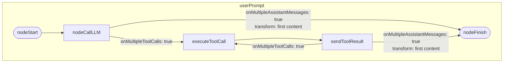

# Agentic Gradle Plugin

A Gradle plugin that provides 


## Mermaid diagram for userPrompt graph

The following Mermaid diagram reflects the graph defined in AgenticTask.kt for the userPrompt subgraph.



## Release Process

```
ORG_GRADLE_PROJECT_mavenCentralUsername=username
ORG_GRADLE_PROJECT_mavenCentralPassword=the_password

ORG_GRADLE_PROJECT_signingInMemoryKey=exported_ascii_armored_key
ORG_GRADLE_PROJECT_signingInMemoryKeyPassword=some_password
```

## TODO
- MCP Client?
- CI/CD
- Console for arbitrary runs?
- 
